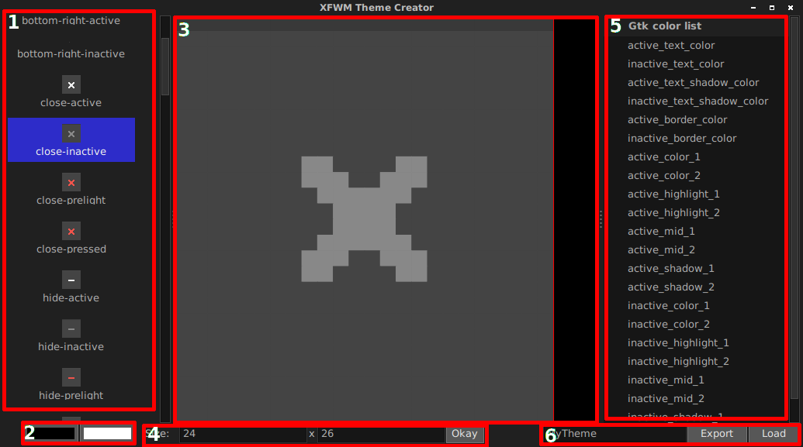

# XFWM_theme_creator
A graphical interface to help with creating XFWM themes

## Installing:

Make sure you have:
- Python3
- PyGTK
- Cairo

```
apt-get install python3
apt-get install python3-gi
apt-get install python3-cairo
```

## Running:

Just run this from a terminal.
`python3 theme_creator.py`


## How to use:



### 1
> This is a list of the icons that makes up the theme. Click one of these to make it show up in the [editor](#3).

> If you're creating a new theme all of these will be blank.

### 2
From left to right:

> Background Color. This is the color that fills the background.

> Foreground Color. This is the color that you paint with in the foreground.

### 3
> The painting area. The item you click in the list from #1 will be modified.

> The color you paint will be the foreground from #2. You will also paint with the variable you have selected in #5.

> If you have painted with a variable a red box will appear around the pixel. You can hover over it to see what var was used.

### 4
> The width and height of the area you're working with. You can change this then press "Okay" to modify the values.

> **This will destroy all your work on the current area.**

## 5

> A list of GTK variables you can use. They will change based on the current theme you have set.

> When you paint with these you can see a red box around the pixel you painted.
> You can then hover over this box and see what variable was used.

### 6

From left to right:
> Theme name: The name of folder to create when you press 'Export'

> Export: Exports the current theme to a .tar.gz file. You can then copy this file to your .themes folder and extract it.

> Load: Loads an already existing theme. This has to be the xfwm4 folder or a folder with xfwm4 in it.


## Note:

I may add themerc file support sometime in the future. Depends on how much people use this / want it.

Currently some of the code isn't commented or is a little messy. I plan to clean it up.
